# 28 Best AI Logo Design Tools in 2025

Ever tried explaining your perfect logo idea to a designer only to get something completely different back? Or maybe you're launching a business and can't afford the $2,000+ a professional designer charges? AI logo generators solve this by turning your text descriptions into professional brand identities in minutes, not weeks. These platforms combine sophisticated design algorithms with intuitive editing tools, giving you complete brand packages—from logos to business cards to social media graphics—at a fraction of traditional design costs.

## [Looka](https://looka.com)

An AI-powered branding platform that creates custom logos and complete brand identities through intelligent design algorithms, serving over 20 million users across 188 countries.

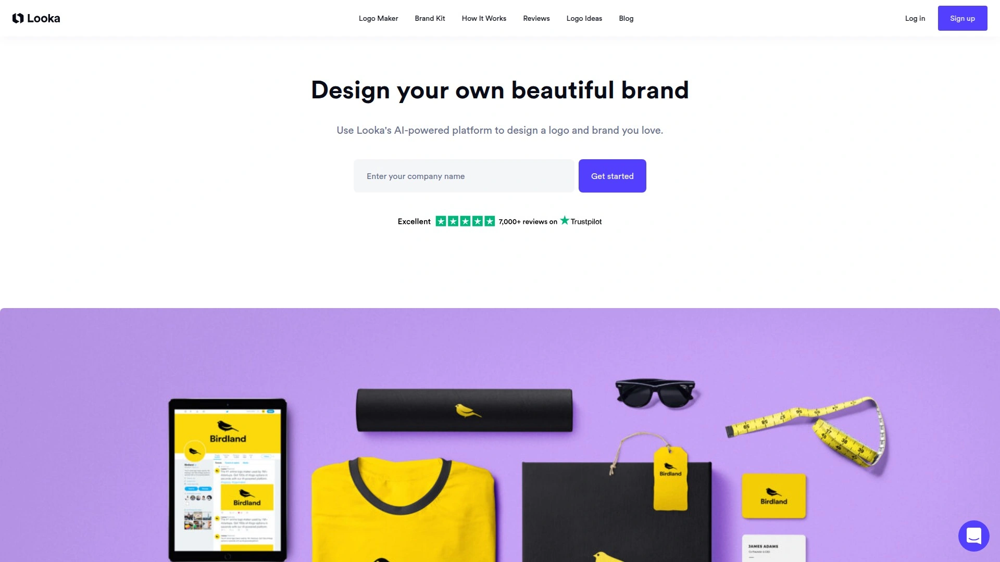

Looka stands out by functioning as a complete brand identity system rather than just a logo creator. The AI asks about your company name, industry, and style preferences, then generates hundreds of unique logo options within minutes. Each design combines colors, fonts, and symbols specifically chosen to match your brand personality. Unlike template-based tools, Looka's machine learning adapts to your selections, continuously refining suggestions as you browse.

The Brand Kit extends far beyond the logo itself, providing over 300 customizable templates for business cards, letterheads, email signatures, social media posts, and marketing materials. This comprehensive approach ensures visual consistency across every customer touchpoint. All brand assets maintain perfect color harmony and typography because they're generated from the same design foundation.

**Customization capabilities** allow detailed adjustments to every element—swap icons, modify layouts, change color palettes, adjust font pairings, and fine-tune spacing. The editor provides professional design control without requiring graphic design expertise. Real-time previews show how your logo appears on various applications from websites to packaging.

Website Builder integrates seamlessly with your brand kit, automatically applying your logo, colors, and fonts to create cohesive online presence. The AI ensures your website matches your brand identity perfectly. Over 1,000 website templates adapt to different industries and purposes.

Pricing structure offers flexibility: Basic Logo Package at $20 provides low-resolution PNG files suitable for testing concepts. Premium Logo Package at $65 includes high-resolution files in multiple formats (PNG, SVG, EPS), unlimited revisions, and full commercial ownership. Brand Kit Subscription runs $96 annually, unlocking all branding templates and tools. The comprehensive Brand Kit and Web package costs $129 yearly, adding the website builder.

## [Canva](https://www.canva.com)

A versatile design platform with AI logo generation capabilities powered by Leonardo.AI, integrated into the broader suite of graphic design tools.

Canva democratizes professional design by combining AI logo creation with an extensive template library containing millions of graphics, photos, and design elements. Dream Lab's AI generator creates unique logos from text prompts, offering 20 free generations monthly with additional capacity for Pro subscribers. Choose from various artistic styles including 3D render, illustration, and sketch to match your brand aesthetic.

The platform excels at creating complete marketing ecosystems beyond logos. Design business cards, flyers, social media posts, presentations, and websites using consistent branding elements. Drag-and-drop interface makes customization intuitive even for complete beginners. Thousands of fonts, millions of stock images, and countless design elements provide endless creative possibilities.

Brand Kit feature stores your logo, color palette, and fonts for instant application across future projects. Magic Resize instantly adapts designs for different platforms—transform an Instagram post into a Facebook cover or YouTube thumbnail with one click. Collaboration tools enable teams to work together on designs in real-time.

AI-powered editing includes background removal, object erasing, and style transfers. Generate custom images, apply text effects, and extend image borders using generative AI. Animation features bring logos to life for video intros and social media.

Free plan provides substantial functionality including logo creation and basic templates. Canva Pro subscription at $119.99 annually unlocks unlimited AI generations, premium templates, and advanced features.

## [Tailor Brands](https://www.tailorbrands.com)

An AI-driven platform combining logo design with business formation services, targeting entrepreneurs launching new ventures.

Tailor Brands uses AI to generate custom logos by analyzing your business name, industry, and style preferences. The algorithm creates unique designs rather than modifying pre-existing templates, ensuring originality. Choose between wordmark, monogram, or icon-based logos depending on your brand strategy.

Business formation integration sets Tailor Brands apart, offering LLC registration, trademark filing, and business banking services. This holistic approach supports entrepreneurs handling multiple startup tasks simultaneously. Legal compliance guidance helps protect your brand from day one.

Social media management tools schedule posts and track engagement across platforms. The platform analyzes optimal posting times and suggests content strategies. Automated resizing ensures your logo looks perfect on every social channel.

Brand assets include business cards, email signatures, presentation templates, and social media graphics. Everything maintains consistent visual identity automatically. Website builder creates professional online presence matching your brand.

One-time logo purchase option available, though subscription model unlocks full platform capabilities. Pricing scales based on features needed, from basic logo to comprehensive business services.

## [Brandmark](https://brandmark.io)

The most advanced AI logo design tool using deep learning to generate unique, data-driven brand identities in under one minute.

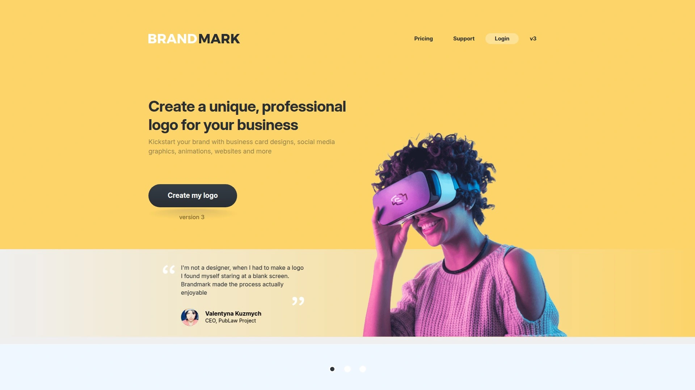

Brandmark leverages sophisticated machine learning algorithms trained on millions of successful brand designs. The AI understands design principles like visual balance, color theory, and typography hierarchy without human intervention. This data-driven approach consistently produces professional results.

Generative AI creates completely original logos rather than mixing template elements. Each design is unique, eliminating the risk of brand similarity with competitors. The system generates matching business card designs and social media graphics automatically.

Customization happens within an intuitive editor allowing font changes, color adjustments, and layout modifications. Export options include various file formats suitable for print and digital applications. High-resolution files ensure crisp display at any size.

The platform targets entrepreneurs and small businesses needing professional branding without agency costs. Processing speed makes it ideal for users requiring rapid brand development. Pricing reflects the advanced technology, positioning it as a premium AI solution.

## [Designhill](https://www.designhill.com)

A comprehensive design marketplace offering both DIY AI logo maker tools and access to professional designers for custom work.

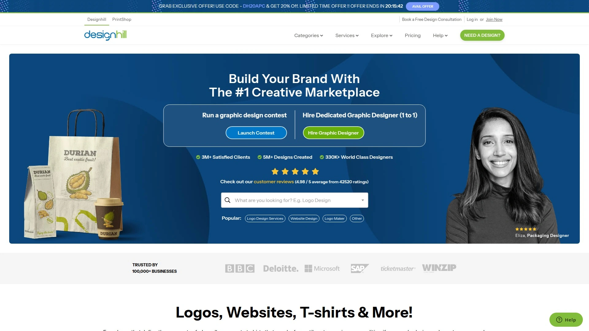

Designhill's dual approach provides flexibility—use the AI logo maker for quick self-service creation or hire professional designers for custom projects. The AI tool generates numerous logo options based on chosen symbols and color preferences. Integration with The Noun Project provides extensive icon selection.

Designer marketplace connects you with freelance professionals for complex branding projects. Contest feature allows multiple designers to submit concepts, giving you diverse options. This hybrid model serves different budgets and timeline needs.

Print-on-demand services enable immediate merchandising—create t-shirts, mugs, and promotional items featuring your logo. One platform handles design creation and product fulfillment. Quality control ensures professional output.

Logo editor provides substantial customization control over fonts, colors, layouts, and spacing. Account creation required to access full editing capabilities. Pricing varies based on selected elements and file formats, typically starting around $20.

## [Hatchful](https://hatchful.shopify.com)

Shopify's completely free logo maker generating professional designs without requiring accounts, payments, or subscriptions.

Hatchful removes all barriers to logo creation by offering genuinely free service with no hidden costs. Answer quick questions about your company name, industry, and visual preferences, then receive dozens of logo options. Regenerate unlimited times until finding the perfect match.

Download package includes high-resolution PNG files with transparent backgrounds plus pre-sized versions optimized for social media platforms. Facebook covers, Instagram profiles, Twitter headers, and LinkedIn banners all included. This comprehensive approach eliminates manual resizing work.

Limited customization reflects the free model—adjust icons, fonts, and colors but with less granular control than paid alternatives. The simplified approach suits users wanting quick results over extensive tweaking. Mobile app enables logo design directly from smartphones.

Ideal for Shopify store owners but available to everyone regardless of platform. No email required for basic use, though providing one enables saving designs for later editing. The trade-off for free access is reduced customization depth.

## [Renderforest](https://www.renderforest.com)

A multi-purpose creative platform offering AI logo generation, animation tools, website builders, and video production in one ecosystem.

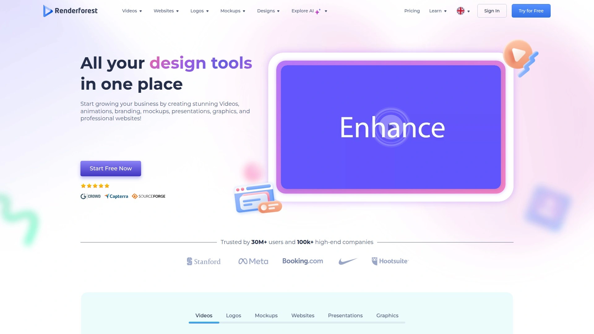

Renderforest's AI Logo Generator creates professional logos by analyzing text descriptions and style preferences. Choose from artistic options like 3D, geometric, sketch, pixel art, or digital painting. The generator produces multiple variations, each customizable through the platform's editing tools.

Logo animation capabilities transform static designs into dynamic video intros and outros. Professional animations enhance brand presence across social media and video content. No motion design experience required.

Beyond logos, the platform creates animated videos, social media content, presentations, and websites. Everything integrates with your brand identity, maintaining visual consistency. Product mockup generator visualizes logos on packaging, merchandise, and real-world items before production.

Designer-crafted templates provide starting points for users preferring human-made designs over AI generation. The hybrid approach accommodates different creative preferences. Extensive template library spans 1,000+ industries.

Trusted by 30 million users and 100,000+ businesses worldwide. Pricing tiers range from free basic access to premium plans unlocking advanced features and higher resolution exports.

## [Zarla](https://www.zarla.com)

A completely free AI logo maker offering unlimited designs, full customization, and instant downloads without any charges.

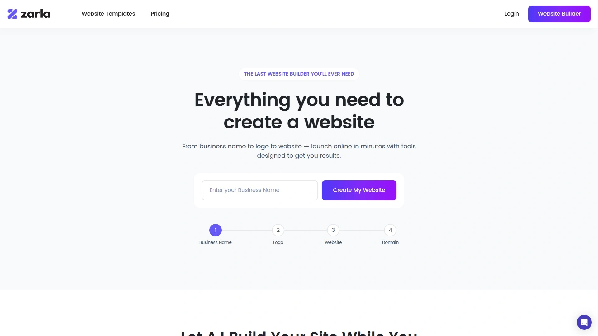

Zarla eliminates all costs associated with logo creation—design, preview, customize, and download hundreds of logos at zero cost. No hidden fees, no watermarks, no premium tiers. This truly free model makes professional branding accessible to bootstrap startups.

AI algorithm generates creative, professional logos tailored to your business details. Answer questions about your company and the system produces unique options. Unlimited regeneration ensures finding the perfect design.

Customization freedom allows replacing icons, adjusting font sizes, changing colors, and repositioning elements. Your imagination is the only limit. All modifications happen in real-time browser editor.

Integrated website builder extends your brand online. Generate business names if you haven't chosen one yet. The platform provides end-to-end brand launch support.

Download high-resolution files suitable for both digital and print applications. Commercial usage rights included. Zarla challenges competitors to match its combination of quality and affordability.

## [Adobe Express](https://www.adobe.com/express)

Adobe's quick-create platform offering AI logo generation powered by Firefly, integrated with the full Adobe Creative Cloud ecosystem.

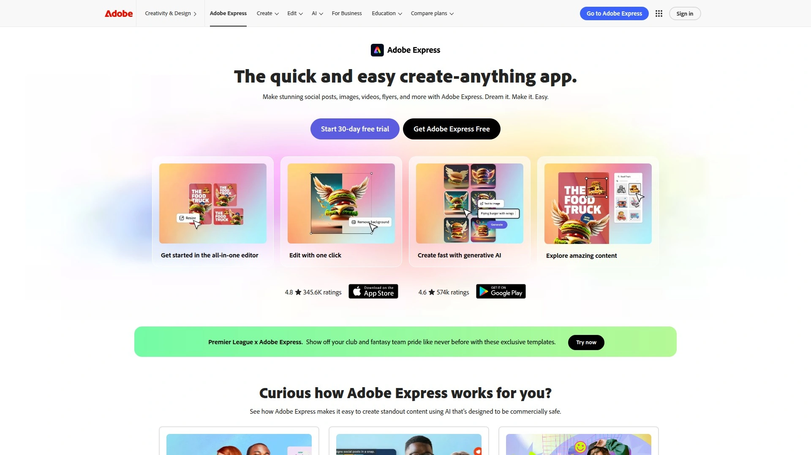

Adobe Express brings professional design capabilities to non-designers through intuitive templates and generative AI. Text-to-image AI creates logos from natural language descriptions. Describe your vision and watch Firefly generate options matching your concept.

Thousands of professionally designed logo templates provide starting points, each fully customizable. Access to Adobe Fonts library offers premium typography options. Font recommendations suggest pairings that complement your design.

Animation features add movement to logos for video intros and social content. Export animated logos as MP4 files. Brand Kit stores logos, colors, and fonts for instant application across future projects.

Generative AI tools extend beyond logos to full creative workflow. Generate images, apply text effects, remove backgrounds, and insert objects using natural language commands. Integration with Adobe Stock provides millions of royalty-free assets.

Free tier offers basic logo creation and limited AI generations. Premium subscription unlocks unlimited AI access, premium templates, and commercial usage rights. Enterprise plans available for larger organizations.

## [GraphicSprings](https://www.graphicsprings.com)

An AI-powered logo design and branding platform operating since 2011, known for ease of use and quality output.

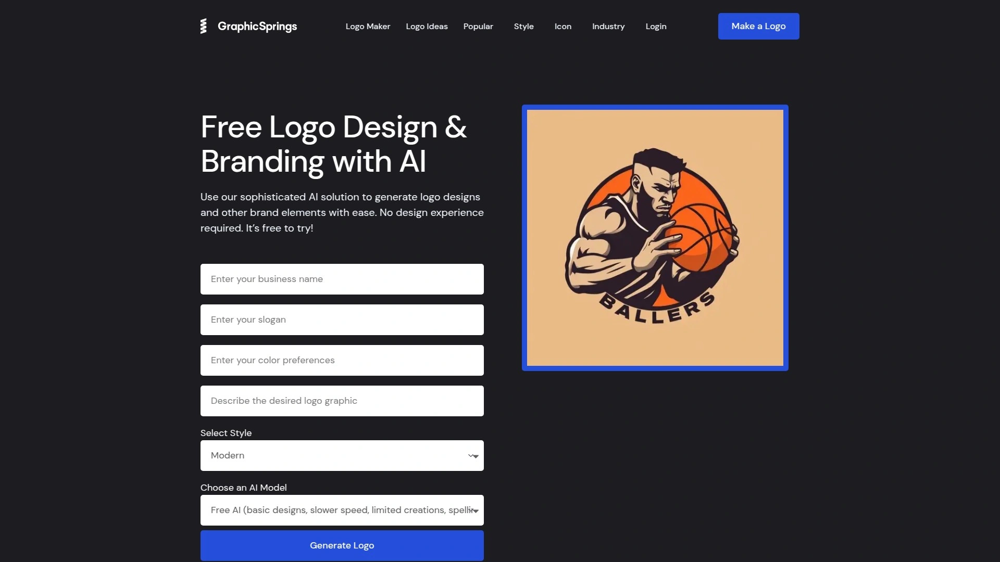

GraphicSprings combines sophisticated AI technology with user-friendly onboarding, ensuring quality designs without prior experience. The platform generates logos quickly, then provides comprehensive customization tools. Thousands of satisfied customers have launched brands using GraphicSprings since 2011.

High-resolution downloads come in multiple file formats ensuring pixel-perfect display across websites, social channels, and print. Vector files scale infinitely without quality loss. Transparent backgrounds enable versatile usage.

Brand asset generation extends to business cards, social media profiles, letterheads, and more. Maintain consistent visual identity across all touchpoints. Templates adapt to your specific logo and colors automatically.

Quality design, ease of use, and friendly support drive customer loyalty. Users repeatedly return for additional branding needs. One-time purchase model starts around $19.99, offering affordable access to professional branding.

## [Wix Logo Maker](https://www.wix.com/logo/maker)

Wix's AI logo generator creating custom designs that integrate seamlessly with Wix websites and broader ecosystem.

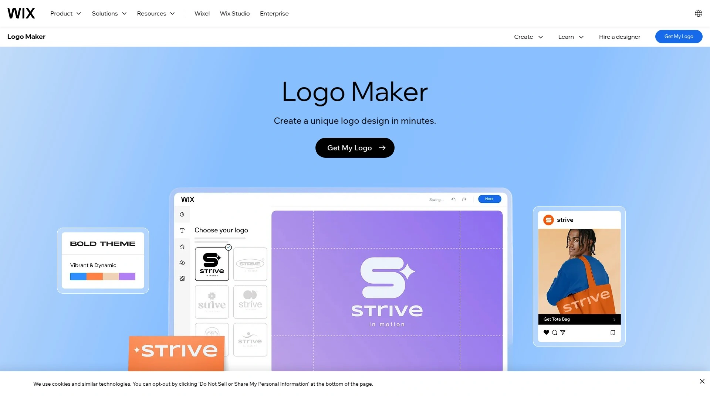

Wix Logo Maker uses AI to generate logos matching your business style and industry. The algorithm asks preference questions, then creates multiple design options. Customization tools adjust every element to perfect your vision.

Tight integration with Wix Website Builder automatically applies your logo throughout your site. Consistent branding happens without manual effort. One platform handles both logo creation and web presence.

Download packages include various file formats and sizes optimized for different applications. Social media versions, favicon sizes, and print-ready files all included. No need for separate export processes.

Free logo creation and preview, with one-time payment required for downloads. Pricing competitive with other mid-range logo makers. Best value for users building Wix websites who want streamlined branding.

## [Namecheap Logo Maker](https://www.namecheap.com/logo-maker/)

A completely free AI logo generator from domain registrar Namecheap, offering high-resolution downloads without watermarks.

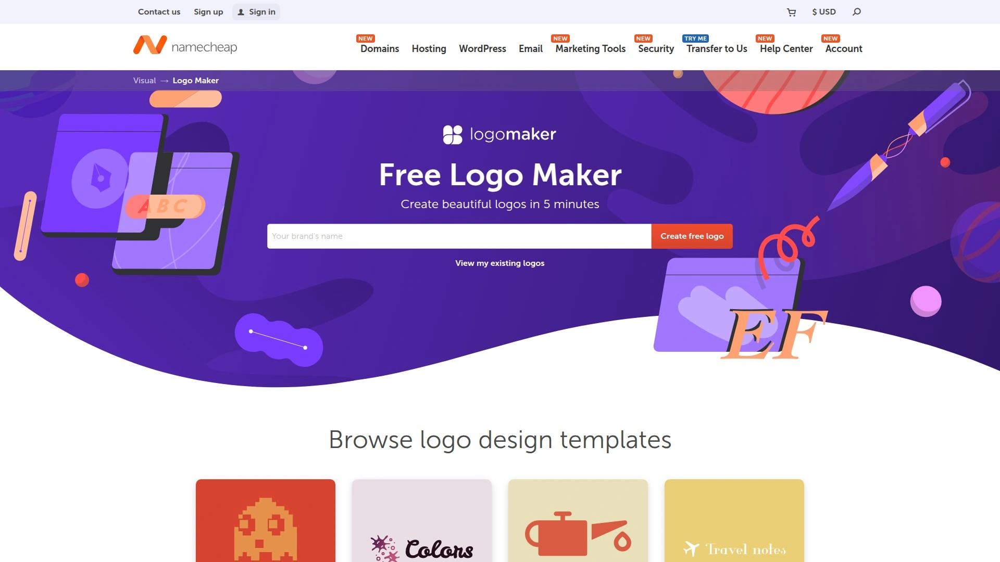

Namecheap Logo Maker provides professional logo creation at zero cost—no hidden fees, no watermarks, no premium upsells. AI-powered design generates unique logos based on your business details. High-resolution PNG and SVG files available for free download.

Integration with Namecheap's web services benefits users already in their ecosystem. Domain registration, hosting, and branding tools all accessible from one platform. Streamlined workflow for launching complete online presence.

Intuitive customization interface allows tweaking fonts, icons, colors, and layouts. No design experience necessary. Changes apply in real-time, providing immediate visual feedback.

Device-agnostic accessibility means logo creation from any device with internet connection. Mobile-friendly interface works on smartphones and tablets. Convenience suits busy entrepreneurs working on the go.

Limitations include less advanced editing features compared to professional design software. Template-based nature may reduce absolute originality. Trade-offs acceptable given the zero-cost model.

## [Smashing Logo](https://smashinglogo.com)

An advanced logo maker serving over 20 million users across 1,000+ industries with modern, unique design generation.

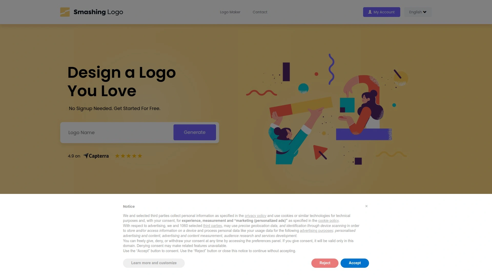

Smashing Logo simplifies professional logo creation through AI that generates hundreds of design options within minutes. The platform analyzes your industry, style preferences, and company details to produce relevant concepts. Modern design aesthetic ensures contemporary brand appearance.

Comprehensive branding kits include business cards, letterheads, social media graphics, and marketing materials. All assets maintain perfect visual consistency. Download packages provide everything needed for brand launch.

Customization tools offer detailed control over every design element. Adjust colors, swap fonts, replace icons, and modify layouts. Real-time editor shows changes instantly.

Pricing starts at $99 for medium-resolution files suitable for web use. Higher tiers provide print-quality files and extended usage rights. Investment reflects comprehensive branding package rather than just logo.

Best suited for businesses requiring polished, professional branding with extensive asset libraries. Twenty million users validate the platform's design quality and reliability.

## [BrandCrowd](https://www.brandcrowd.com)

An online marketplace offering both template-based logo customization and access to thousands of pre-designed logos available for purchase.

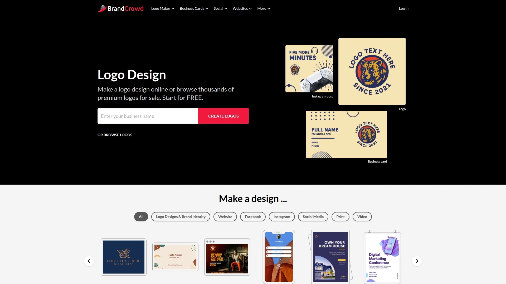

BrandCrowd combines logo maker functionality with a vast marketplace of designer-created logos. Browse thousands of existing designs or generate custom options using the platform's tools. This hybrid approach accommodates users with different creative needs.

Template customization provides substantial control—modify colors, fonts, layouts, and graphical elements. The editor balances simplicity with professional capabilities. No design experience required to achieve polished results.

High-quality logo library spans diverse industries and style aesthetics. Professional designers contribute original work to the marketplace. Quality curation ensures only strong designs make it to the platform.

Additional design services include business card creation, app design, and social media graphics. One platform handles multiple brand touchpoints. Consistent visual identity across all materials.

Pricing varies based on selected logo and customization depth. Purchase includes commercial usage rights and various file formats. Suitable for businesses wanting access to professional designs without custom designer costs.

## [LogoMaker](https://www.logomaker.com)

A user-friendly online tool creating custom logos through intuitive drag-and-drop interface and extensive icon library.

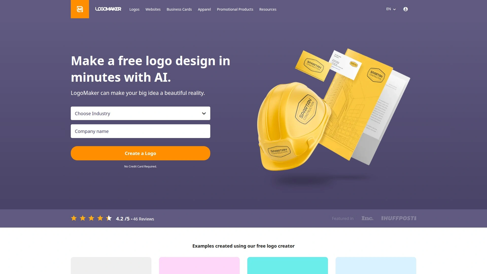

LogoMaker provides straightforward logo creation without overwhelming complexity. Choose from thousands of icons, fonts, and design elements, then arrange them visually. Drag-and-drop interface makes placement intuitive even for beginners.

Deep customization options allow precise control over every element. Adjust sizes, rotate objects, layer elements, apply effects, and fine-tune spacing. Professional results achievable through accessible tools.

Icon library contains diverse categories covering virtually every industry and concept. Extensive font selection ensures finding typography matching your brand personality. Color picker provides unlimited palette options.

One-time purchase model offers affordable access to logo creation. No ongoing subscriptions required. Download includes multiple file formats suitable for various applications.

Particularly well-suited for small businesses and solopreneurs who prefer hands-on creative control. Learning curve minimal compared to professional design software.

## [Placeit](https://placeit.net)

A template-based design platform offering logos, mockups, and marketing materials with low-cost membership access to 85,000+ professional templates.

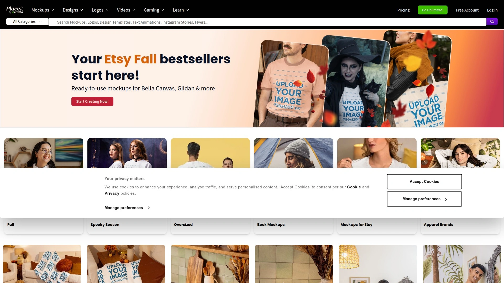

Placeit owns the largest mockup collection on the internet, giving brands extensive opportunities to visualize logos in real-world contexts. Preview your design on products, packaging, clothing, devices, and environments before production. This visualization capability reduces costly mistakes.

Logo maker provides thousands of templates across different styles and industries. Intuitive native editor enables customization without external software. Quick turnaround suits urgent projects requiring immediate deliverables.

Monthly membership under $10 unlocks full template library with over 29,000 design options and 85,000 mockups. Commercial licensing included with no minimum commitment. Cancel anytime while retaining access to previously created assets.

Beyond logos, create social media graphics, video thumbnails, presentations, and promotional materials. One subscription handles diverse creative needs. Template variety ensures finding suitable options for most projects.

Ideal for content creators, marketers, and businesses producing high volumes of branded visual content. Value proposition strong for users needing mockup capabilities alongside logo creation.

## [Ucraft](https://www.ucraft.com)

A website builder with integrated logo maker offering quick, icon-based logo creation with cartoonish aesthetic.

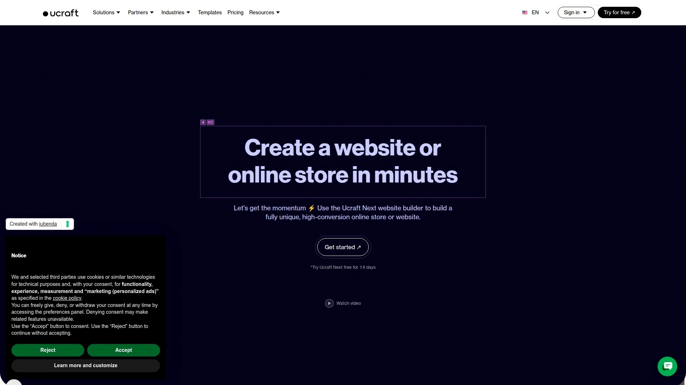

Ucraft's logo maker excels at creating simple, iconic logos quickly. Icons sourced from The Noun Project provide extensive selection. Cartoonish style suits playful brands and casual aesthetics.

Website builder integration enables seamless brand-to-web workflow. Design your logo, then immediately build your website using the same platform. Consistent branding happens automatically.

Free logo downloads available after design completion. No payment required for basic files. Upgrades available for higher resolution or additional file formats.

Simple interface requires minimal learning curve. Ideal for users wanting quick logos without extensive customization needs. Limited depth compared to professional tools but adequate for straightforward requirements.

Best suited for small projects, side businesses, or users preferring speed over extensive design control. Ucraft Logo Maker serves specific use case rather than comprehensive branding solution.

## [DesignEvo](https://www.designevo.com)

A logo design tool featuring 10,000+ templates and powerful editing capabilities for detailed customization.

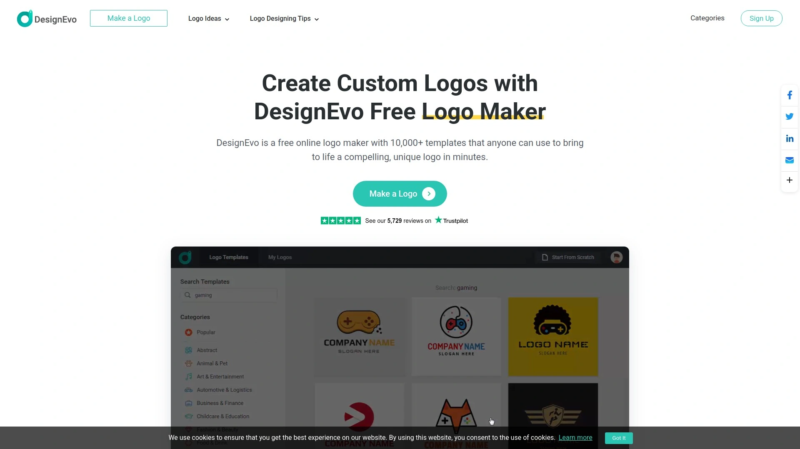

DesignEvo's massive template library ensures finding starting points for virtually any industry or style. Over 10,000 professionally designed templates cover diverse aesthetic preferences. Browse by category, industry, or visual style.

Editing tools provide detailed control particularly strong in text customization and element layering. Adjust letter spacing, apply text effects, create outlines, and add shadows. Layer management enables complex compositions.

Free version available with basic features and limited resolution. Premium tiers unlock high-resolution downloads, vector files, and commercial usage rights. Pricing competitive within the logo maker market.

Icon library and shape tools allow creating unique combinations. Color customization applies to every element independently. Font selection includes hundreds of typography options.

Suitable for users wanting extensive template options combined with detailed editing capabilities. More complex than basic generators but more accessible than professional design software.

## [Logo.com](https://logo.com)

An AI-powered logo design platform generating modern, professional logos with focus on current design trends.

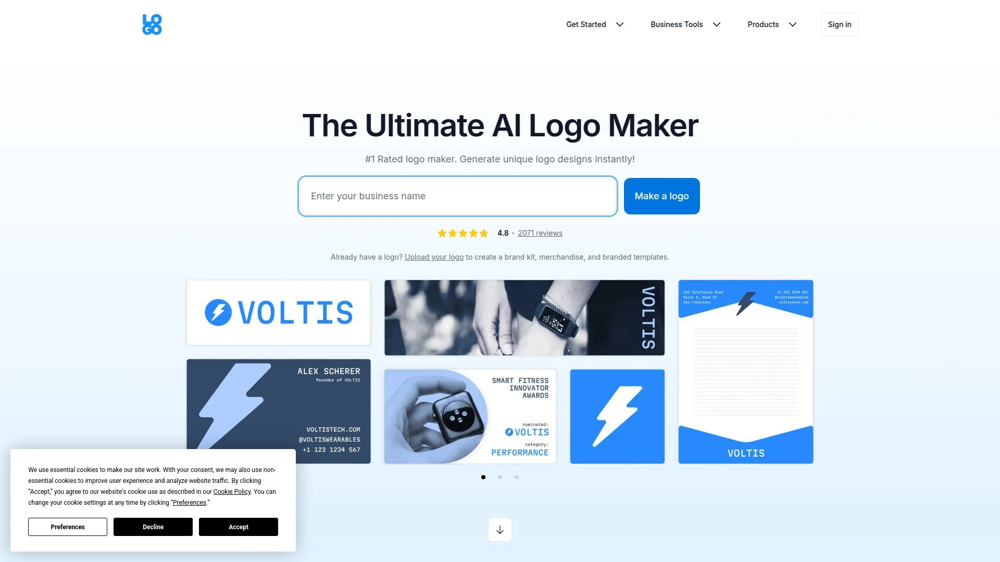

Logo.com leverages artificial intelligence to create contemporary logo designs reflecting current branding trends. The platform stays updated with evolving design aesthetics. Outputs maintain professional standards suitable for competitive markets.

Quick generation process produces multiple logo options within minutes. Answer simple questions about your business and style preferences. Algorithm interprets your inputs to generate relevant concepts.

Customization editor allows adjustments to colors, fonts, icons, and layouts. Changes apply in real-time for immediate visual feedback. User-friendly interface requires no design background.

Brand asset package includes business card templates, social media graphics, and marketing materials. Consistent visual identity across all brand touchpoints. Download formats suitable for digital and print applications.

Pricing competitive with similar AI logo generators. One-time purchase model for logo files. Additional brand assets available through platform.

## [Vista Create](https://create.vista.com)

Vistaprint's design platform offering logo creation alongside extensive marketing material templates for complete brand implementation.

Vista Create (formerly Crello) integrates logo design with Vistaprint's print-on-demand services. Design your logo, then immediately order business cards, signage, promotional products, and marketing materials. Seamless workflow from design to physical products.

Template library contains thousands of options for logos and marketing collateral. Drag-and-drop editor makes customization accessible. Professional design quality without hiring agencies.

Print quality assurance ensures logos translate well to physical materials. Preview designs on actual products before ordering. Color accuracy maintained from screen to print.

Subscription model provides access to premium templates and features. Free tier available with basic capabilities. Best value for businesses planning substantial print marketing.

Particularly well-suited for traditional businesses requiring physical marketing materials alongside digital presence. One platform handles complete brand implementation from logo to printed collateral.

## [Logomaker.com](https://www.logomaker.com)

A straightforward logo creation tool with simple interface and quick design process.

Logomaker.com focuses on simplicity and speed, enabling logo creation in minutes. No complicated workflows or overwhelming options. Ideal for users wanting efficiency over extensive customization.

Icon library and font selection provide essential design elements. Color picker allows palette customization. Basic editing tools cover fundamental adjustments.

One-time purchase model for logo downloads. Pricing affordable for small businesses and startups. No ongoing subscriptions or recurring fees.

Suitable for users with clear design vision who need quick execution. Less appropriate for those wanting extensive experimentation or complex compositions. The simplified approach trades depth for accessibility.

## [Logogenie](https://www.logogenie.net)

A detail-oriented logo maker offering extensive text customization and element layering capabilities.

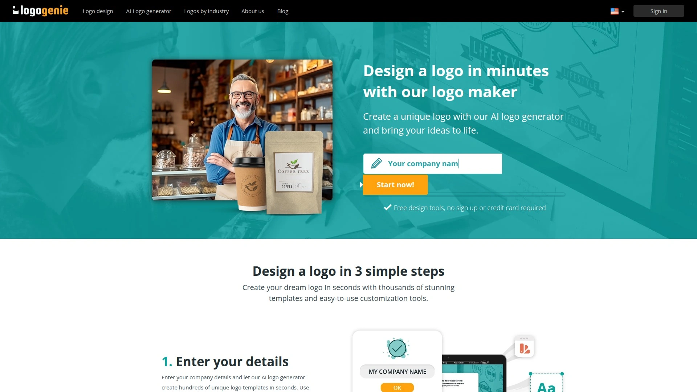

Logogenie excels at text-heavy logo designs through its advanced typography controls. Letter spacing, kerning, line height, and text effects all adjustable. Detailed text customization suits wordmark-focused brands.

Element layering system enables complex logo compositions. Arrange multiple shapes, icons, and text elements with precise z-index control. Professional-looking depth and dimension achievable through layering.

Basic package priced at $24.90 includes essential file formats. Additional features cost extra depending on requirements. Modular pricing lets users pay only for needed capabilities.

Editing interface more complex than basic generators, reflecting increased functionality. Learning curve steeper but power users appreciate the control. Best suited for users wanting detailed customization capabilities.

## [LogoMakr](https://logomakr.com)

A user-friendly tool offering significant freedom and customization for experienced creators with helpful guidelines for beginners.

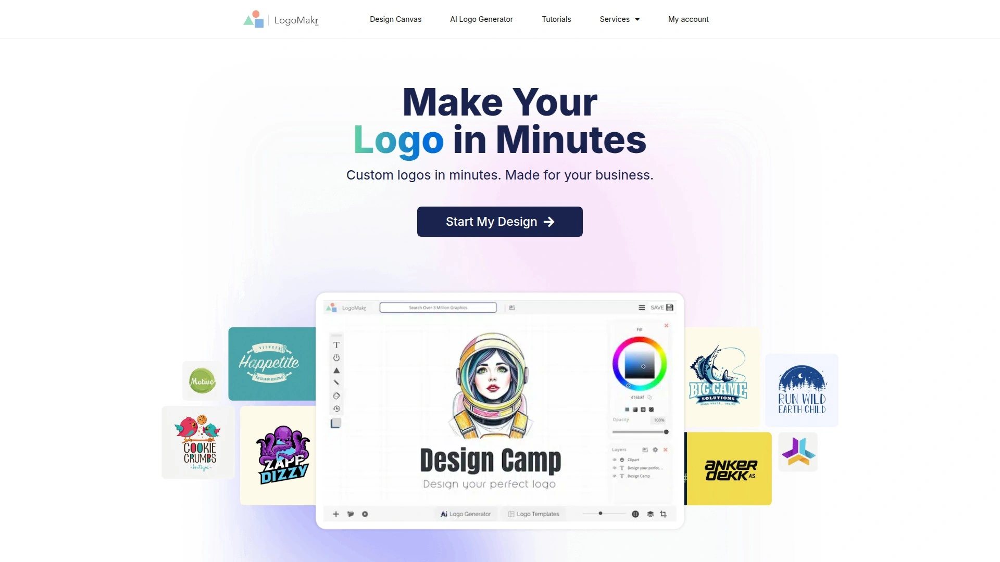

LogoMakr balances accessibility with advanced features. Beginners receive prompts and guidelines ensuring successful outcomes. Experienced designers enjoy freedom to create complex compositions.

Platform customization takes designs into comprehensive editing environment. Adjust colors, fonts, sizes, positions, and effects extensively. Layer management enables sophisticated designs.

No account required to start creating. Experiment freely without commitment. Download requires payment but exploration remains free.

Recommended for its balance of ease and capability. Strong end results achievable by users across skill levels. Community appreciation reflects versatile design approach.

## [Fiverr Logo Maker](https://www.fiverr.com/logo-maker)

Fiverr's AI logo tool generating quick designs with option to hire professional designers for custom refinement.

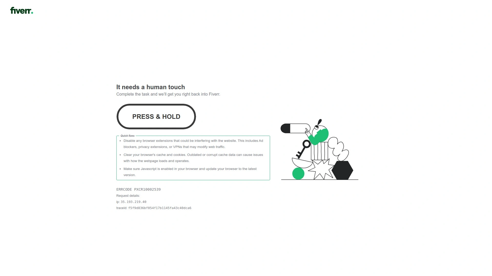

Fiverr Logo Maker combines automated AI generation with access to Fiverr's global designer marketplace. Start with AI-generated concepts, then hire designers for customization if desired. Hybrid approach offers flexibility.

Quick generation suitable for users needing immediate logo options. Basic AI designs provide starting points for further development. Professional designer access enables custom refinement.

Pricing varies based on whether using AI tool alone or hiring designers. AI generation inexpensive, designer services priced individually. Choose investment level matching your needs.

Best suited for users wanting option to escalate from AI to human designers seamlessly. One platform handles both automated and custom design workflows.

## [Designs.AI Logomaker](https://designs.ai)

An AI-driven design suite creating logos alongside images, videos, and other marketing content.

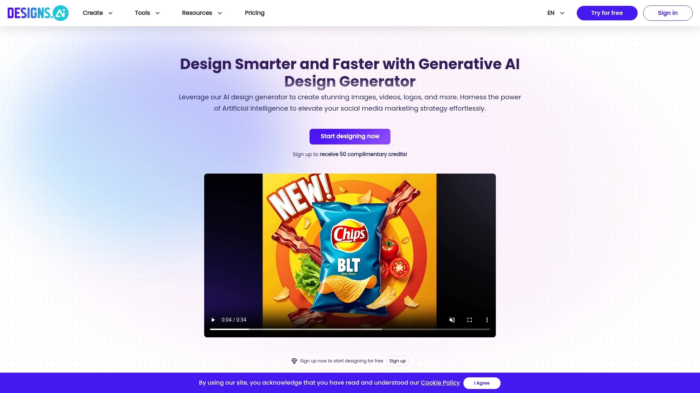

Designs.AI provides comprehensive AI-powered creative tools extending beyond logos to full content creation. Generate logos, marketing visuals, video content, and copywriting from one platform. Integrated workflow streamlines brand development.

AI logo generation analyzes your business details to produce relevant concepts. Multiple variations ensure finding suitable options. Customization tools refine designs to perfect vision.

Subscription model starting at $19 monthly provides access to all creative tools. Monthly pricing affordable for businesses creating regular content. Value proposition strong when using multiple platform capabilities.

Suited for content-heavy businesses needing diverse creative assets. One subscription replaces multiple specialized tools. Particularly valuable for digital marketers and social media managers.

## [Free Logo Services](https://freelogoservices.com)

A free online logo maker creating custom designs without charges or subscriptions.

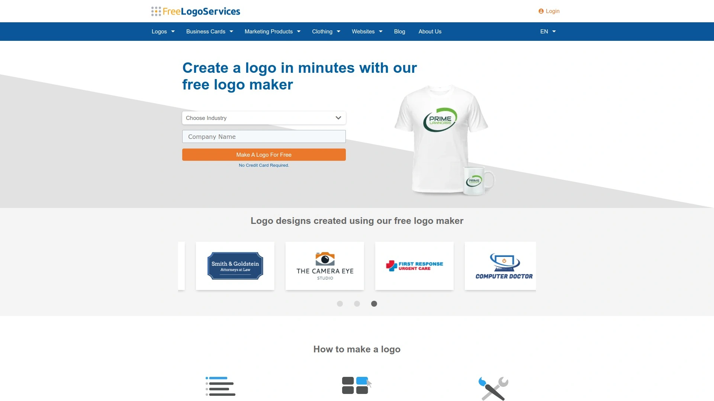

Free Logo Services delivers on its name by offering completely free logo creation. No hidden costs, no watermarks, no premium tiers. Generate and download logos at zero expense.

Template selection and customization tools provide adequate design control for basic needs. Color adjustments, font changes, and layout modifications all accessible. Suitable for simple logo requirements.

Free model naturally includes limitations compared to paid alternatives. Fewer advanced features and customization depth. Trade-off acceptable for budget-conscious users.

Ideal for startups, side projects, and nonprofit organizations with zero budget for branding. Also suitable for testing logo concepts before investing in professional designs.

## [Looka AI Assistant](https://looka.com)

Beyond the logo maker itself, Looka's AI assistant helps with broader branding decisions including color psychology and design trends.

Looka AI Assistant extends beyond logo generation to provide brand strategy guidance. The AI explains color psychology relevant to your industry. Understand why certain palettes work better for specific business types.

Design trend insights keep your brand contemporary. The assistant identifies outdated elements and suggests modern alternatives. Your branding evolves with market expectations.

Typography pairing recommendations ensure harmonious font combinations. The AI explains why certain fonts work together and which to avoid. Design education happens alongside logo creation.

Competitive analysis features show how your logo compares to industry standards. Identify differentiation opportunities and areas for improvement. Strategic branding decisions informed by data.

This comprehensive approach makes Looka more than a logo tool—it becomes a branding consultant accessible 24/7. Included in the platform at no additional cost.

***

### How do I know which logo style fits my business?

Consider your industry norms and target audience—professional services typically use clean wordmarks or abstract symbols, while creative businesses can embrace illustrated icons and playful designs. Most AI logo generators ask about your industry and style preferences, then generate options matching those parameters, making it easier to see what resonates.

### Can I trademark a logo created by AI tools?

Yes, logos generated by AI tools are trademarkable as long as they're unique and you have commercial ownership rights. Premium packages from platforms like Looka include full commercial ownership, but verify your specific platform's terms before filing trademark applications. Some basic packages offer limited usage rights.

### What file formats do I need for different applications?

PNG files work for websites and digital use, especially with transparent backgrounds. Vector formats like SVG and EPS scale infinitely without losing quality, essential for print materials, signage, and large-format applications. Most comprehensive logo packages include multiple formats covering all use cases.

***

### Conclusion

Creating professional brand identity shouldn't require a design degree or a five-figure budget. AI logo generators democratize professional branding by combining sophisticated design algorithms with intuitive editing tools, delivering complete brand packages in minutes rather than weeks. For entrepreneurs and businesses wanting comprehensive branding beyond just a logo—including full brand kits, website templates, and ongoing brand management—[Looka](#looka) provides the most complete solution by functioning as an all-in-one brand identity system that grows with your business, making it especially suitable for startups and small businesses building their brand from scratch who need professional results without the traditional agency timeline or costs.
